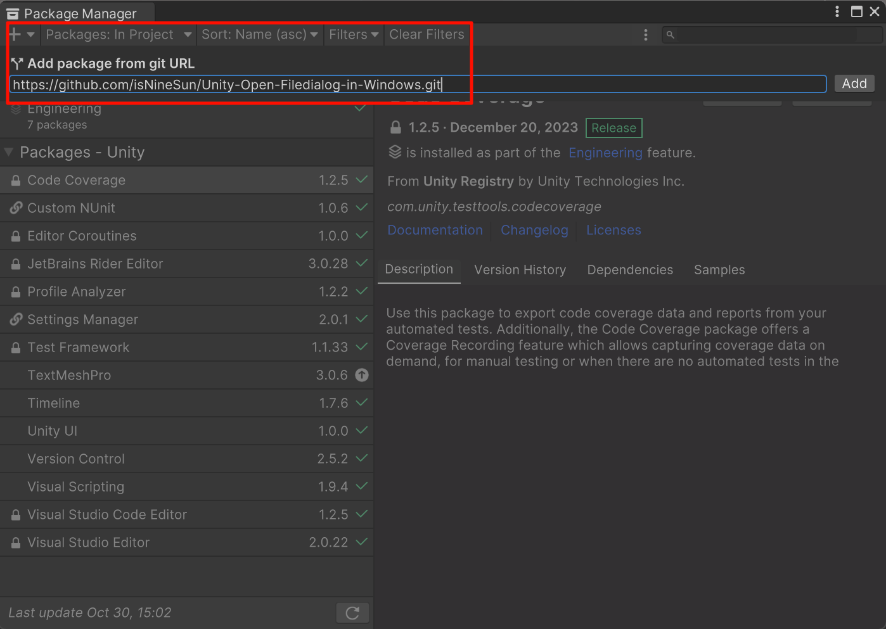
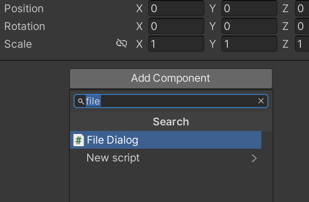

# Open FileDialog in Unity

This package is designed to invoke the native Windows folder selection dialog and can be used in both Unity editor and native Windows environments.

## How to install
### Option 1: Package Manager (Unity 2019.3 and higher)
1. Open the Unity project and go to ``Window`` > ``Package Manager``.
2. Click the ``+`` button in the top left corner and select ``Add package from git URL....``
3. Enter your Git URL:

```
https://github.com/isNineSun/Unity-Open-Filedialog-in-Windows.git
```
    

### Option 2: Package Manager (Manual)
- Open `%projectname%/Packages/manifest.json`
- Add the following to the dependencies section:
```
"com.ninesun.openfiledialogwin": "https://github.com/isNineSun/Unity-Open-Filedialog-in-Windows.git"
```

### Option 3: Download zip (not recommended)
You can click the green code button in the upper right corner of the GitHub homepage and download the zip file. After unzipping, put the FileDialogWin folder in the resource directory.

## How to use
- Add the `FileDialog` component to the gameobject that the script you want to reference the method is mounted on.   
    
- You can simply reference the `OpenFilePanel` function like this:    
```csharp
using System.Collections;
using System.Collections.Generic;
using UnityEngine;

public class test : MonoBehaviour
{
    private FileDialog FileDialog;
    private string filePath;
    // Start is called before the first frame update
    void Start()
    {
        FileDialog = FindObjectOfType<FileDialog>();
    }

    public void ChooseFile()
    {
        string path = FileDialog.OpenFilePanel("Select a file", "", "txt");
        if (!string.IsNullOrEmpty(path))
        {
            filePath = path;
            Debug.Log("File selected: " + filePath);
        }
    }
}

```
    
## Parameter Description
```csharp
//title: It represents the default file name or file path displayed in the file dialog.
//defaultPath: default path
//extension：File filter, in the form of "txt" or "md", does not contain wild matches
public string OpenFilePanel(string title, string defaultPath, string extension)
```